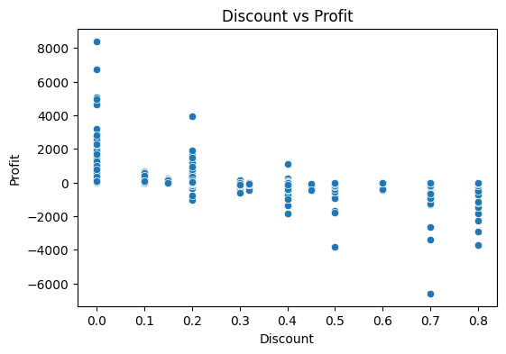

# Retail Sales Intelligence & Profit Optimization System

## 🎯 Objective
To analyze retail sales performance and optimize profitability by identifying key business drivers such as sales trends, discount impact, and product-level profitability using SQL, Python, and Power BI.

---

## 🏢 Business Problem
Retail companies often face:
- High sales but low profit
- Excessive discounting
- Unprofitable product categories
- Poor regional performance visibility

This project solves these issues using data-driven insights.

---

## 🛠 Tech Stack
- SQL (Data extraction, cleaning, KPI generation)
- Python (Pandas, NumPy, EDA)
- Power BI (Interactive dashboard)
- Excel (Optional preprocessing)

---

## 📊 Dataset
Superstore Retail Dataset including:
- Sales
- Profit
- Quantity
- Discount
- Category & Sub-Category
- Region
- Customer Segment

---

## 🔑 Key Features

### 📌 Sales Performance Analysis
- Monthly and yearly sales trends
- Revenue growth tracking

### 📌 Profitability Analysis
- Profit margin calculation
- Loss-making product detection

### 📌 Discount Impact Analysis
- Relationship between discount and profit
- Identification of over-discounted products

### 📌 Regional Performance
- Sales and profit by region
- High vs low-performing regions

### 📌 Product Analysis
- Top and bottom performing products
- Category-level insights

---

## 📈 Key Insights (Data-Driven Findings)

### 📊 Monthly Sales vs Profit Trend

- Sales fluctuate across months due to seasonality
- Profit does not always follow sales trend
- Some high-sales months show reduced profitability due to discounts

---

### 📉 Discount vs Profit Relationship

- Higher discounts strongly reduce profit
- Many transactions operate at low or negative margins
- Discounting strategy needs optimization

---

### 🌍 Regional Performance Analysis

- Some regions generate high revenue but low profit
- Performance varies significantly across geography
- Indicates inefficient regional strategy allocation

---

### 📦 Category Performance Analysis

- Revenue is concentrated in a few categories
- Some high-sales categories are less profitable
- Portfolio optimization is required

## 📊 Power BI Dashboard
Includes:
- KPI Cards (Sales, Profit, Margin)
- Trend Analysis (Monthly Sales/Profit)
- Region Heatmap
- Category Breakdown
- Discount vs Profit Scatter Plot

---

## 💼 Business Impact
This system helps businesses:
- Optimize pricing strategy
- Reduce unnecessary discounting
- Improve profit margins
- Identify weak product categories
- Improve regional strategy decisions

---

## 🚀 Future Improvements
- Sales forecasting using Python (Prophet/ARIMA)
- Customer segmentation (RFM analysis)
- Real-time dashboard integration
